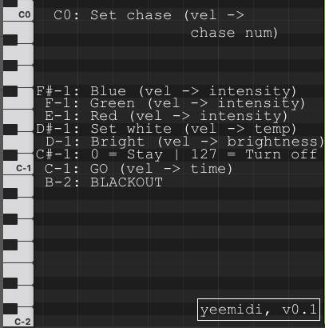
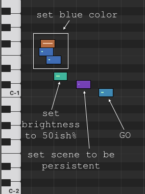
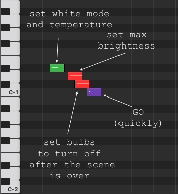

# yeemidi
Control your Yeelight bulbs using MIDI!

## Usage

### Initial configuration

- Prior to first use, all Yeelight bulbs have to be "activated" and connected to the same network as the computer, that runs this script. This is so far done by using the official Yeelight app running on a smartphone. 
- Then a `wizard_configuration` has to be executed. This utility finds all the bulbs on the network and lets user assign them to a given group. All bulbs within the given group receive the same commands. There can be a total of 16 groups (&rarr; 16 MIDI channels).
- A `config.yml` file is created. This file can be edited.

### Command Description

- When `main` executable is started, a new virtual MIDI device `yeemidi` is created and shall be visible within MIDI outputs in DAW (Logic Pro). 
- This virtual device accepts MIDI messages on all channels.
- Messages on channel `n` will be sent to bulbs within the group `n`.
- Only `NOTE ON` MIDI messages take any effect.
- Main idea is to preset a "scene" using some messages (MIDI notes) and then launch it using `GO` message (note). 

### Message Description

  

- B-2: __BLACKOUT__
   - Turn off signal is issued immediately after this Note is played.
   - Velocity of a MIDI message has no effect.
- C-1: __GO__
   - After a scene is preset using upper notes, this note launches it
   - Velocity sets transition tine (0 = quickest, 127 = slowest)
- C#-1: __TURNOFF BEHAVIOR__
   - This note determines, if the bulbs within the group turn off after this scene is over, or if they remain lit
   - Velocity 0 = stay lit, velocity 127 = turn off after the scene is done
- D-1: __BRIGHTNESS__
   - Sets brightness of the bulbs
   - Velocity 0 = dimmest, velocity 127 = brightest
- D#-1: __WHITE TEMP__
   - Sets bulbs to white mode
   - Velocity 0 = warmest, velocity 127 = coolest
> ![NOTE]
> The most intense light output is achieved when this parameter is set in the middle (64-ish). Author assumes, that in this case, both warm and cool LEDs within the bulb are lit 100 %.
- E-1: __RED__
   - Sets bulbs to RGB mode
   - Velocity determines red component in resulting color
- F-1: __GREEN__
   - Sets bulbs to RGB mode
   - Velocity determines the green component in resulting color
- F#-1: __BLUE__
   - Sets bulbs to RGB mode
   - Velocity determines the blue component in resulting color
- C0: __CHASE__
   - Experimental feature, sets scene to predefined chase from chase table.

### Examples

  
  

## Operation Notes

### Not working well

- Trying multiple groups to do the same thing at the same time. It will never happen at the same time, delays will be introduced and it won't look nice. (Since the bulbs do not support multicast)

### Working kinda well

- Events on bulbs at the same group occur nearly at the same time.

- The most intense output is when the bulb is set to `CT` mode and the temperature is set halfway in between.
